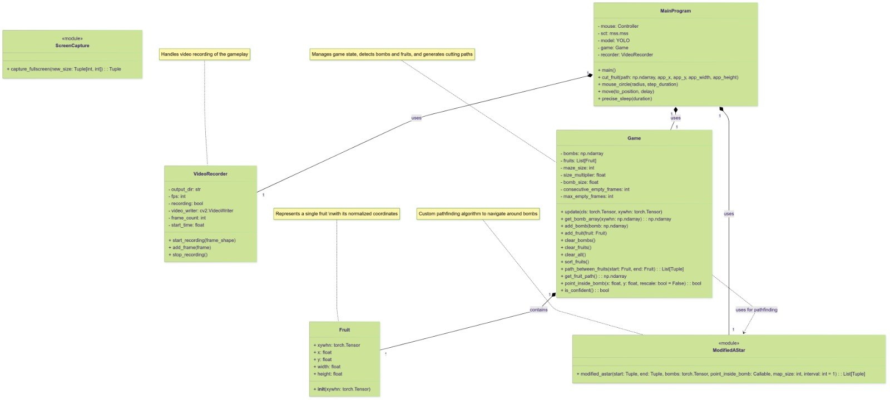
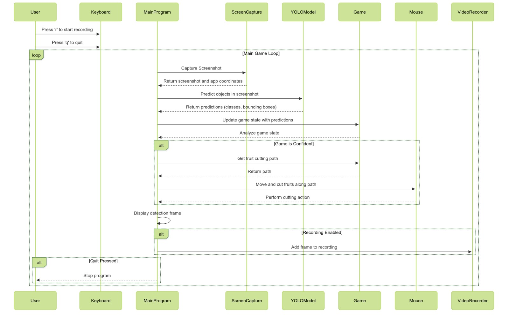
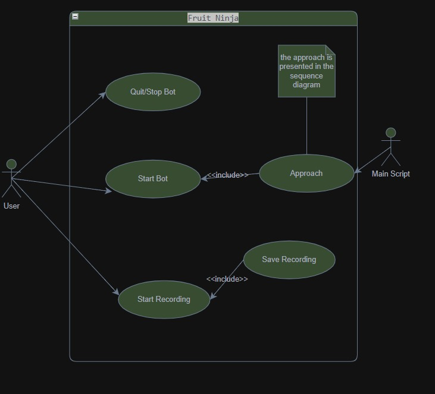

UML Diagrams
============

This page presents the UML diagrams that illustrate the architecture and functioning of the Fruit Ninja V8 system.

Class Diagram
-------------

The class diagram describes the static structure of the Fruit Ninja V8 system, showing the different classes and their relationships. It provides an overview of the software components that make up our solution, their attributes and methods, as well as the associations between them.

This diagram highlights the modular organization of the system, where each class has a specific responsibility in the process of object detection and decision-making for slicing the fruits.

   Fruit Ninja V8 Class Diagram

Sequence Diagram
----------------

The sequence diagram illustrates the interactions between the different components of the system over time. It shows how objects communicate with each other during the execution of the main functionalities of the Fruit Ninja V8 system.

This diagram allows understanding of the flow of operations from the screenshot capture to the slicing of the fruits, passing through object detection and calculation of the optimal path.

   Sequence Diagram of the main operations of Fruit Ninja V8

Use Case Diagram
----------------

The use case diagram presents the interactions between the Fruit Ninja V8 system and its users. It identifies the different functionalities offered by the system from the user's point of view.

This diagram allows visualization of the different ways the system can be used and the goals it enables to achieve, such as automatic detection of fruits, avoidance of bombs, or recording of game sessions.

   Fruit Ninja V8 Use Case Diagram
