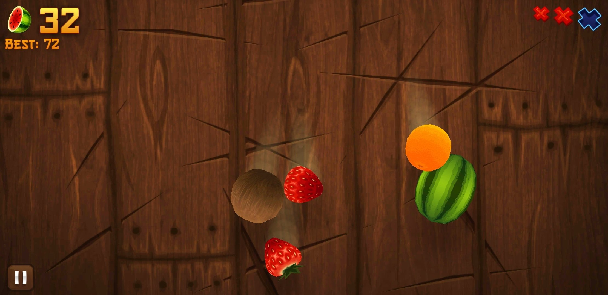

.. raw:: html

   

     
     <h1 style="margin: 0;">Pourquoi Utiliser Fruit Ninja comme Domaine de Vision par Ordinateur</h1>
   

===================================================================

Introduction
-----------

Fruit Ninja représente un terrain d'expérimentation idéal pour explorer et développer des concepts avancés de vision par ordinateur. Ce jeu mobile populaire offre un environnement contrôlé mais dynamique qui permet de tester diverses approches d'intelligence artificielle dans un contexte ludique et accessible.

Défis de Vision par Ordinateur dans Fruit Ninja
----------------------------------------------

Détection d'Objets en Temps Réel
^^^^^^^^^^^^^^^^^^^^^^^^^^^^^^^

Le jeu présente plusieurs défis techniques majeurs pour les systèmes de vision par ordinateur. La détection d'objets multiples en mouvement rapide nécessite des algorithmes optimisés capables de traiter les images à haute fréquence tout en maintenant une précision élevée. Les fruits apparaissent sous différents angles, tailles et vitesses, créant un environnement de test robuste pour les modèles de détection.

Classification Multi-Classes Dynamique
^^^^^^^^^^^^^^^^^^^^^^^^^^^^^^^^^^^^^

Fruit Ninja implique la classification simultanée de plusieurs types d'objets : fruits comestibles, bombes dangereuses et objets spéciaux. Cette diversité d'éléments à identifier en temps réel constitue un excellent cas d'usage pour tester la robustesse des modèles de classification d'images. La distinction entre objets bénéfiques et nuisibles ajoute une dimension stratégique à la simple détection.

Suivi d'Objets et Prédiction de Trajectoire
^^^^^^^^^^^^^^^^^^^^^^^^^^^^^^^^^^^^^^^^^^

Les objets dans le jeu suivent des trajectoires physiques réalistes influencées par la gravité. Cette caractéristique permet de développer et tester des algorithmes de suivi d'objets et de prédiction de mouvement, compétences essentielles en vision par ordinateur pour de nombreuses applications industrielles et robotiques.

Avantages Pédagogiques et Pratiques
----------------------------------

Environnement Contrôlé
^^^^^^^^^^^^^^^^^^^^

Contrairement aux applications de vision par ordinateur dans le monde réel, Fruit Ninja offre un environnement graphique contrôlé avec des conditions d'éclairage constantes et des arrière-plans prévisibles. Cela permet de se concentrer sur l'optimisation des algorithmes sans les complications liées aux variations environnementales.

Feedback Instantané
^^^^^^^^^^^^^^^^^

Le système de score intégré du jeu fournit un retour immédiat sur les performances de l'IA, permettant une évaluation quantitative directe de l'efficacité des algorithmes développés. Cette caractéristique facilite l'ajustement et l'amélioration itérative des modèles.

Accessibilité et Reproductibilité
^^^^^^^^^^^^^^^^^^^^^^^^^^^^^^^^

L'utilisation d'un jeu populaire et largement disponible garantit que les résultats de recherche peuvent être facilement reproduits et validés par d'autres chercheurs. Cette accessibilité favorise la collaboration et le partage de connaissances dans la communauté de vision par ordinateur.

Applications Transférables
-------------------------

Systèmes de Défense Aérienne
^^^^^^^^^^^^^^^^^^^^^^^^^^^

L'analogie entre Fruit Ninja et les systèmes de défense aérienne est particulièrement frappante. Les algorithmes développés pour ce projet peuvent être directement transposés à des applications militaires critiques :

**Détection et Suivi de Drones** : Tout comme l'IA doit détecter et classer les fruits volants, les systèmes de défense aérienne doivent identifier et suivre des drones hostiles parmi d'autres objets volants. Les techniques de détection multi-objets développées pour distinguer les fruits des bombes s'appliquent parfaitement à la différenciation entre drones civils, militaires et débris.

**Optimisation de Trajectoires de Missiles** : L'algorithme A* utilisé pour planifier le chemin optimal de découpe des fruits peut être adapté pour calculer les trajectoires de missiles intercepteurs. L'objectif devient alors de neutraliser le maximum de cibles avec un minimum de projectiles, optimisant ainsi l'efficacité et réduisant les coûts opérationnels.

**Interception Multi-Cibles** : Le concept de "combo" dans Fruit Ninja, où une seule action peut éliminer plusieurs fruits, trouve son équivalent dans les systèmes d'interception qui cherchent à neutraliser plusieurs menaces avec un seul missile. Les algorithmes de pathfinding développés peuvent calculer des trajectoires permettant à un projectile d'intercepter plusieurs drones en séquence.

Navigation Robotique
^^^^^^^^^^^^^^^^^^

Les techniques de pathfinding développées pour éviter les bombes tout en collectant les fruits peuvent être directement appliquées à la navigation robotique, où les robots doivent éviter les obstacles tout en atteignant leurs objectifs.

Surveillance et Sécurité
^^^^^^^^^^^^^^^^^^^^^^^

Les algorithmes de détection d'objets multiples développés pour Fruit Ninja peuvent être adaptés pour des systèmes de surveillance, où il est nécessaire d'identifier et de suivre plusieurs entités simultanément dans des flux vidéo.

Interface Homme-Machine
^^^^^^^^^^^^^^^^^^^^^^

L'optimisation des temps de réponse et la précision requise dans Fruit Ninja sont directement applicables au développement d'interfaces gestuelles et de systèmes de réalité augmentée.

Pourquoi IA dans Fruit Nnija
---------------------------

   **Importance de l'IA dans Fruit Ninja**

Comme nous pouvons le constater, les objets affichés à l’écran dans Fruit Ninja sont en 3D. Cela signifie qu’il est impossible de fixer un seuil ou une hauteur unique sur l’écran pour appliquer une approche de type « fenêtre glissante » sur tous les fruits. Il ne suffit donc pas de chercher une correspondance de position pour effectuer une coupe facilement. C’est pourquoi des techniques avancées sont nécessaires pour localiser avec précision les fruits et les bombes, afin d’être plus confiants et rapides. Cela justifie l’utilisation d’un modèle de détection d’objets