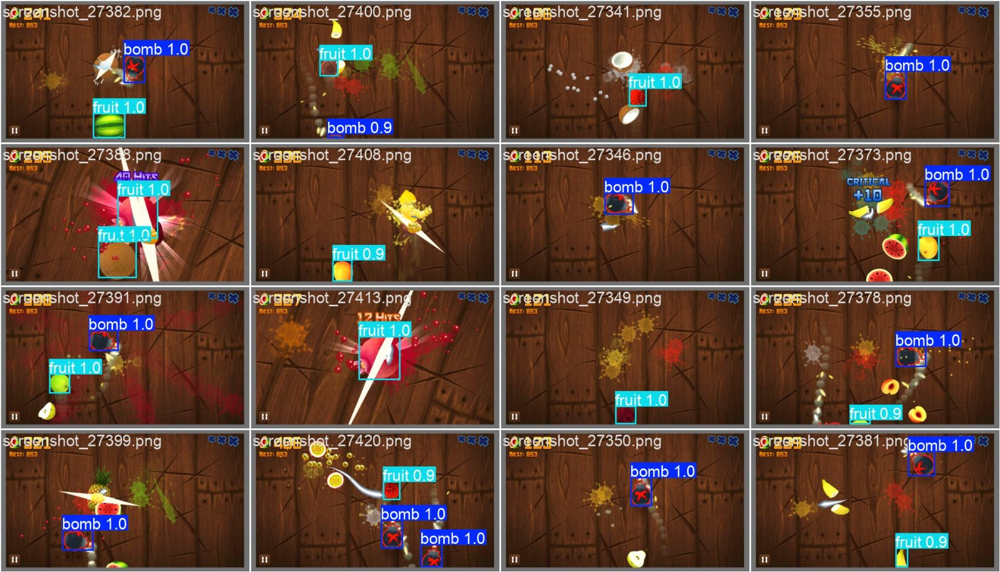
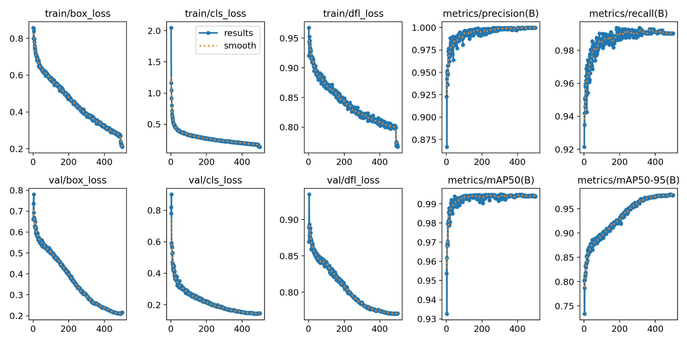
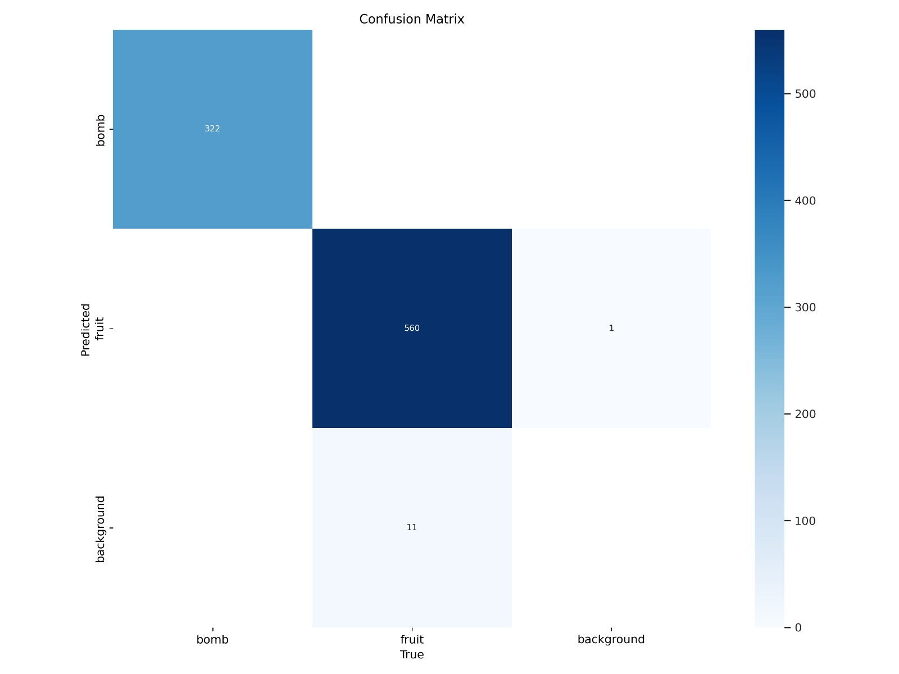
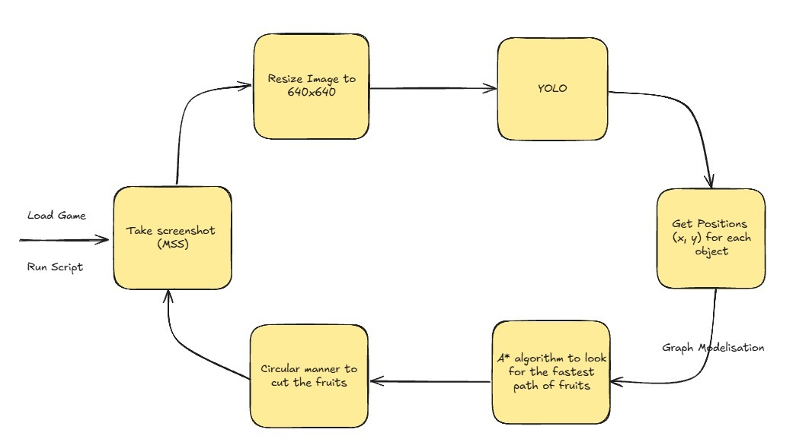

.. raw:: html

   

     
     <h1 style="margin: 0;">Collecte de Données, Modélisation et Techniques de Découpe</h1>
   

=========================================================

Ce document détaille le processus complet de développement du système d'IA pour Fruit Ninja, depuis la collecte des données jusqu'aux techniques de découpe automatisée.

Collecte et Préparation des Données
----------------------------------

Processus de Capture d'Images
^^^^^^^^^^^^^^^^^^^^^^^^^^^^

La création d'un dataset de qualité constitue la première étape cruciale du projet. Pour obtenir des données représentatives du jeu Fruit Ninja, un processus de capture systématique a été mis en place.

**Méthode de Capture** : Plusieurs heures de jeu ont été consacrées à la collecte de données, utilisant la bibliothèque Python MSS (Multi-Screen Screenshots) pour capturer les images d'écran en temps réel. Cette approche garantit une capture haute fréquence et non intrusive du gameplay.

.. code-block:: python

    import mss
    import time
    from PIL import Image
    
    def capture_gameplay():
        with mss.mss() as sct:
            # Définir la zone de capture (zone de jeu)
            monitor = {"top": 100, "left": 200, 
                      "width": 800, "height": 600}
            
            while True:
                # Capturer l'écran
                screenshot = sct.grab(monitor)
                
                # Convertir en image PIL
                img = Image.frombytes("RGB", screenshot.size, 
                                    screenshot.bgra, "raw", "BGRX")
                
                # Sauvegarder avec timestamp
                timestamp = int(time.time() * 1000)
                img.save(f"data/raw_images/frame_{timestamp}.png")
                
                time.sleep(0.1)  # Capture toutes les 100ms

**Volume des Données** : Environ 1500 images ont été collectées, représentant diverses situations de jeu : différentes combinaisons de fruits, positions des bombes, angles de lancement, et états de jeu variés.

Annotation et Étiquetage
^^^^^^^^^^^^^^^^^^^^^^^

L'annotation manuelle des images a été réalisée à l'aide de la plateforme en ligne **makesense.ai**, un outil d'annotation gratuit et intuitif particulièrement adapté aux projets de vision par ordinateur.

**Processus d'Annotation** :

1. **Import des Images** : Téléchargement du dataset sur makesense.ai
2. **Définition des Classes** : 
   - Fruits (banane, pomme, orange, pastèque, etc.)
   - Bombs
3. **Annotation par Bounding Box** : Délimitation précise de chaque objet visible
4. **Export au Format YOLO** : Génération des fichiers d'annotation .txt compatibles

**Défis d'Annotation** :
- Objets en mouvement rapide nécessitant une précision élevée
- Superposition d'objets créant des ambiguïtés de délimitation
- Variation d'échelle des objets selon leur position sur l'écran

Modèle YOLOv8-Nano : Architecture et Performance
-----------------------------------------------

Choix du Modèle
^^^^^^^^^^^^^^

Le modèle **YOLOv8-nano** d'Ultralytics a été sélectionné pour ce projet en raison de ses caractéristiques optimales pour une application en temps réel :

- **Légèreté** : Taille de modèle réduite permettant une inférence rapide
- **Efficacité** : Balance optimale entre précision et vitesse de traitement
- **Flexibilité** : Architecture adaptable aux spécificités du dataset

Métriques de Performance
^^^^^^^^^^^^^^^^^^^^^^

Le modèle final présente des performances exceptionnelles :

Architecture du Système de Décision
^^^^^^^^^^^^^^^^^^^^^^^^^^^^^^^^^^

Le système de découpe automatisée repose sur une architecture modulaire combinant détection, analyse stratégique et exécution de mouvements.

**Pipeline de Traitement** :

Algorithme A* pour l'Optimisation de Trajectoire
^^^^^^^^^^^^^^^^^^^^^^^^^^^^^^^^^^^^^^^^^^^^^^^

L'algorithme A* (A-star) constitue le cœur du système de prise de décision, calculant les trajectoires optimales de découpe.

**Principe de Fonctionnement** :

L'algorithme traite l'écran de jeu comme une grille où chaque position a un coût associé :

.. code-block:: python

    def _distance(start, end):
        return abs(start[0] - end[0]) + abs(start[1] - end[1])

    def modified_astar(start: tuple, end: tuple, bombs: torch.Tensor, point_inside_bomb: callable, map_size: int, interval: int=1):
        # Find the shortest path around the bombs with improved pathing for fruits near bombs
        # Consider 8 directions instead of 4 to allow for more flexible paths
        directions = [(0, 1), (0, -1), (-1, 0), (1, 0), (1, 1), (1, -1), (-1, 1), (-1, -1)]
        close_set = set()
        came_from = {}
        gscore = {start: 0}
        fscore = {start: _distance(start, end)}
        open_heap = []
        heapq.heappush(open_heap, (fscore[start], start))
        
        # Allow for a more direct path toward the end by weighting heuristic
        heuristic_weight = 1.2
        
        while open_heap:
            # Get the point with the lowest fscore
            current = heapq.heappop(open_heap)[1]
            # If the current point is the end point, reconstruct the path and return it
            if current == end:
                path = deque()
                i = interval
                while current in came_from:
                    if i == interval:
                        path.appendleft(current)
                        i = 0
                    current = came_from[current]
                    i += 1
                # Add the last point on the end fruit
                if start in came_from:
                    path.appendleft(start)
                return list(path)
            
            # Add the current point to the close set
            close_set.add(current)
            # Check the neighbors of the current point
            for dx, dy in directions:
                # Get the neighbor point
                neighbor = (current[0] + dx, current[1] + dy)
                # If the neighbor is in the close set, outside the screen, or inside a bomb, skip it
                if (neighbor in close_set or 
                    neighbor[0] < 0 or neighbor[0] >= map_size or 
                    neighbor[1] < 0 or neighbor[1] >= map_size or 
                    point_inside_bomb(neighbor[0], neighbor[1], True)):
                    close_set.add(neighbor)
                    continue
                    
                # Give diagonal moves a slightly higher cost (sqrt(2) ≈ 1.414)
                move_cost = 1.414 if dx != 0 and dy != 0 else 1.0
                
                # Calculate the gscore of the neighbor
                tentative_gscore = gscore[current] + move_cost
                # If the neighbor is not in the open set or the gscore is lower than the current gscore of the neighbor
                if (neighbor not in gscore or tentative_gscore < gscore[neighbor]):
                    # Update the gscore, fscore, and add the neighbor to the open set
                    came_from[neighbor] = current
                    gscore[neighbor] = tentative_gscore
                    # Weight the heuristic to favor more direct paths
                    fscore[neighbor] = gscore[neighbor] + heuristic_weight * _distance(neighbor, end)
                    heapq.heappush(open_heap, (fscore[neighbor], neighbor))
        # If there is no path, return an empty list
        return []

Stratégies de Découpe Avancées
^^^^^^^^^^^^^^^^^^^^^^^^^^^^^

**Priorisation des Cibles** :

Le système évalue chaque situation selon plusieurs critères :

1. **Sécurité** : Évitement absolu des bombes (priorité maximale)
2. **Efficacité** : Maximisation du nombre de fruits coupés par mouvement
3. **Score** : Priorisation des fruits rares et objets bonus
4. **Timing** : Optimisation du moment de découpe selon la trajectoire

**Techniques de Découpe** :

- **Découpe Linéaire** : Trajectoire droite pour fruits alignés
- **Découpe en Arc** : Mouvement courbe pour capturer plusieurs groupes
- **Découpe Séquentielle** : Enchaînement rapide de mouvements courts
- **Découpe d'Évitement** : Contournement des bombes avec trajectoire complexe

Exécution et Contrôle des Mouvements
^^^^^^^^^^^^^^^^^^^^^^^^^^^^^^^^^^^

**Interface de Contrôle** :

Le système traduit les trajectoires calculées en commandes de souris précises :

- **Coordonnées de Départ** : Position initiale du curseur
- **Vitesse de Mouvement** : Adaptée à la distance et au timing requis
- **Précision de Trajectoire** : Interpolation pour mouvements fluides (circulaires)
- **Synchronisation** : Timing précis avec les objets en mouvement

**Optimisations de Performance** :

- **Prédiction de Mouvement** : Anticipation des trajectoires des objets
- **Cache de Calculs** : Réutilisation des chemins similaires
- **Filtrage Temporel** : Lissage des décisions pour éviter les oscillations
- **Adaptation Dynamique** : Ajustement en temps réel selon les performances

